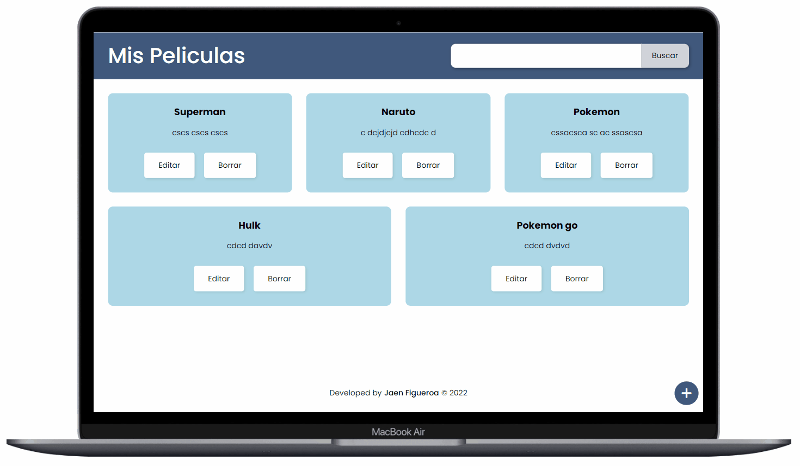

# Manage Movie List app🎬

## 💡 Brief

In this project I have created an application that is used to save a list of movies, we can add their name and description, you can also edit or delete movies, after having saved them.

- ### Desktop preview

<!-- - ### Mobile preview

 -->

## 🚀 Project was developed with

### 1. Languages

&nbsp;&nbsp;

### 2. Library

### 3. Fonts

  - Poppins 400, 500, 600 https://fonts.google.com/specimen/Poppins?query=poppins

### 4. Colors 

  - Blue: #40587c
  - lightblue: #add8e6
  - Gray: #a2aebf

## 📖 New Concepts Mastered and Applied

  - Use of react-router-dom: BrowserRouter, HashRouter, Routes, Route, Navigate, NavLink
  - Hooks: useState, useEffect, useParams, useNavigate
  
## 🌍 Deployment on netlify and Website

You can try my final result [here](https://manage-movie-list.netlify.app/).

