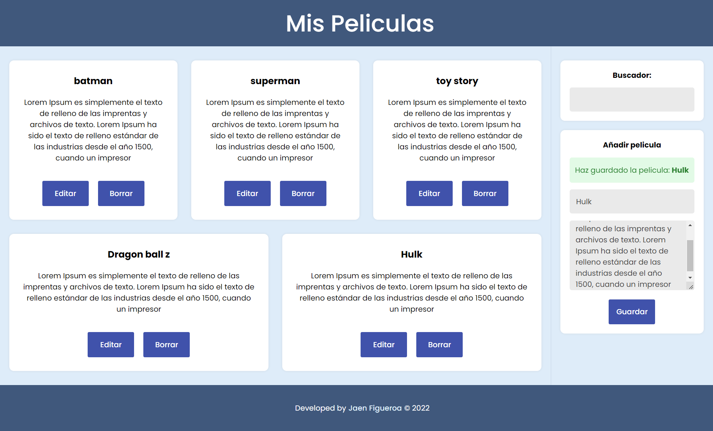

# App for movies 🎬

## 💡 Brief

In this project I have created an application that is used to save a list of movies, we can add their name and description, you can also edit or delete movies, after having saved them.

- ### Desktop preview

<!-- - ### Mobile preview

 -->

## 🚀 Project finished

This project was developed with the following languages and frameworks:
      

&nbsp;&nbsp;

## 🌍 Website

You can try my final result [here](https://jaenfigueroa.github.io/app-for-movies).

